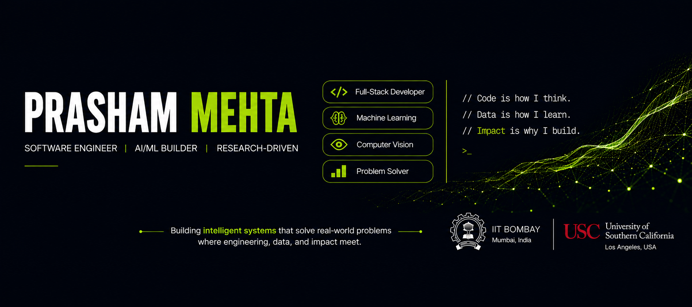

<!-- =========================================================
     PRASHAM MEHTA — GITHUB PROFILE
========================================================== -->

<!-- ==================== BANNER ==================== -->

<picture>
  <source media="(prefers-color-scheme: dark)" srcset="./assests/banner-dark.png">
  <source media="(prefers-color-scheme: light)" srcset="./assests/banner-light.png">
  
</picture>

# Hey there, I'm Prasham Mehta 👋

**AI/ML Researcher @ IIT Bombay × UIDAI · Incoming MSCS @ USC · Published IEEE Author**

 

&nbsp;

&nbsp;

 

<!-- ==================== ABOUT ==================== -->

<h2 align="center">⚡ About Me</h2>

<table>
<tr>
<td width="67%" valign="middle">

I'm an **AI/ML researcher and software engineer** interested in turning research into intelligent systems that work in the real world.

🔬 Worked on **Computer Vision & Contactless Biometrics** at **IIT Bombay × UIDAI**, with research spanning **50K+ hand samples**.

🧠 I work across **Machine Learning, Deep Learning, Computer Vision, Biometrics, LLMs, RAG & Agentic AI**.

📄 **Published IEEE author** with research in medical imaging and fingerprint reconstruction.

🏆 Recipient of the **UIDAI Aadhaar Samvaad Award** for work in contactless biometrics.

💻 I also enjoy building **full-stack & AI-powered systems** — from backend APIs and databases to modern web interfaces.

🎓 Incoming **M.S. Computer Science @ USC**.

> **Code is how I think. Data is how I learn. Impact is why I build.**

</td>
<td width="33%" align="center">

 

**Prasham Mehta**

`AI/ML` · `Software` · `Research`

</td>
</tr>
</table>

 

<!-- ==================== TECH STACK ==================== -->

<h2 align="center">🛠️ Tech Stack</h2>

**AI / Machine Learning**

`Machine Learning` · `Deep Learning` · `Computer Vision` · `LLMs` · `RAG` · `Agentic AI` · `Transformers` · `NLP` · `Biometrics`

 

**Languages**

 

**Web Development**

 

**Databases & Tools**

 

<!-- ==================== GITHUB ACTIVITY ==================== -->

<h2 align="center">📊 GitHub Activity</h2>

 

 

<!-- ==================== SNAKE ==================== -->

<h2 align="center">🐍 Contribution Snake</h2>

<picture>
  <source
    media="(prefers-color-scheme: dark)"
    srcset="https://raw.githubusercontent.com/prasham04/prasham04/gh-pages/github-contribution-grid-snake-dark.svg"
  >
  <source
    media="(prefers-color-scheme: light)"
    srcset="https://raw.githubusercontent.com/prasham04/prasham04/gh-pages/github-contribution-grid-snake.svg"
  >
  
</picture>

 

<!-- ==================== CONNECT ==================== -->

<h2 align="center">🌐 Let's Connect</h2>

&nbsp;

&nbsp;

  

### Building intelligent systems where engineering, data, and impact meet.

`AI/ML` · `Computer Vision` · `Biometrics` · `LLMs` · `Software Engineering`

 

Open to building, research collaborations, and interesting engineering problems.

 

